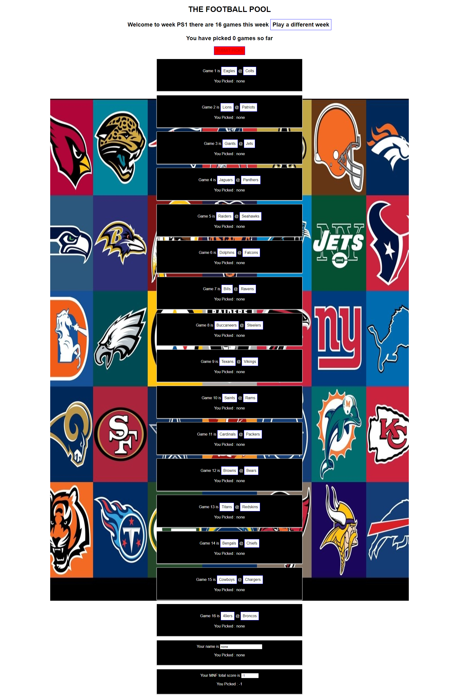
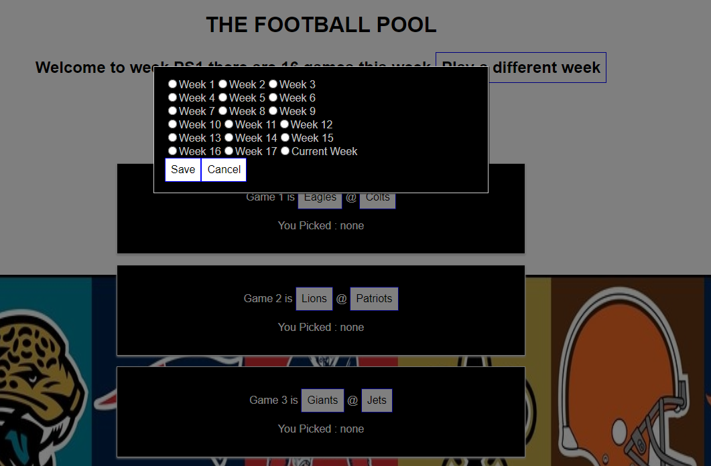
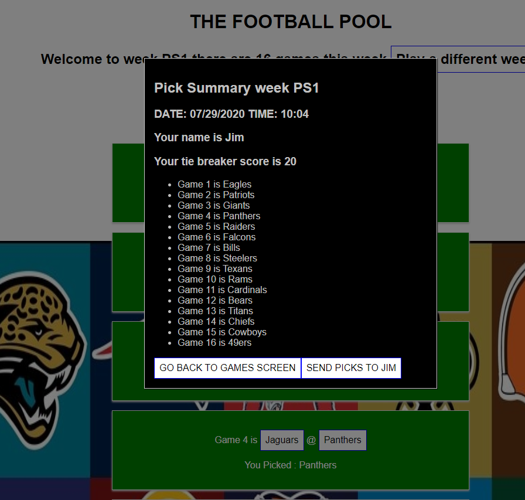

# football_pool

Screen will pull up current weeks football games. So you just have to make your picks, once you do the box will turn green. Once all games are pick & you enter you name & the tie breaking score the "SUBMIT PICKS" button will turn green. Hit that & then cut & paste the info & send it to me.

### Instructions:

-   Screen will load with current weeks games
-   If you want to play another week hit "Play a different week" key
-   The following screen should appear & just chose the week you want & hit "Save"
-   To go back to the same week hit "Cancel"

-   To make your picks do the following
-   Go from game to game & pick the winner by hitting their button
-   The box you did your pick for will turn from black to green
-   The second from the botton box is for your name, just enter it
-   This box will now turn green
-   The bottom box is for the total score of the Monday Night Football game
-   Pick a number betwwen 0 & 100
-   This box will now turn green
-   Go back to the top of the screen & the "SUBMIT PICKS" button should now be green
-   If the "SUBMIT PICKS" submit" button is still red, make sure you made all you picks, put in your name & picked a score
-   Once the "SUBMIT PICKS" submit" button is green hit that button
-   It will take you to the screen below with a list of your pick & the score
-   If you need to make a change hit the "GO BACK TO GAMES SCREEN" button
-   All of you selections will still be marked just change what you want
-   Once you are happy with everything COPY the entire summary
-   Now hit "SEND PICKS TO JIM" button
-   This will bring up your e-mail with my e-mail address will be in TO:
-   PASTE the summary in & hit send
-   the "SEND PICKS TO JIM" button will bring you back to the games screen & all of you picks will be cleared

### Prerequisites

Go into package.json & add the following

-   "homepage": "https://jimdenis.github.io/football-pool",

Within "Scripts" add

-   "predeploy": "npm run build",
-   "deploy": "gh-pages -d build",

### Installing

Run command

-   npm install gh-pages --save-dev

Go into package.json & add the following

-   "homepage": "https://jimdenis.github.io/football-pool",

Within "Scripts" add

-   "predeploy": "npm run build",
-   "deploy": "gh-pages -d build",

Installed to GitHub using

-   np run deploy

## Running the tests

No automated testing

## Built With

-   HTML
-   CSS
-   React
-   JavaScript

## Authors

-   **JIM Denis** - _Initial work_ - [JimDenis](https://github.com/JimDenis)

This app can be found on https://jimdenis.github.io/football-pool/
